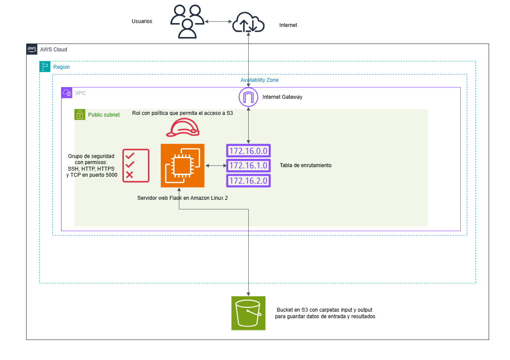
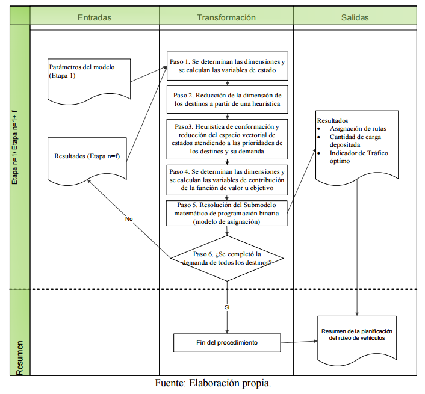
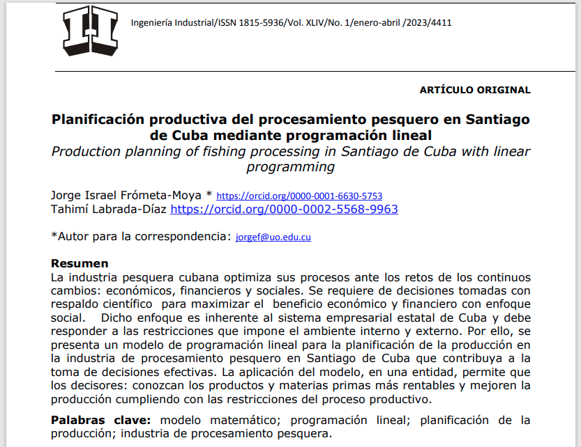
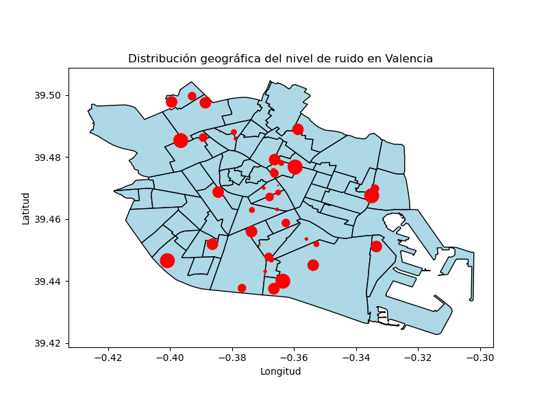
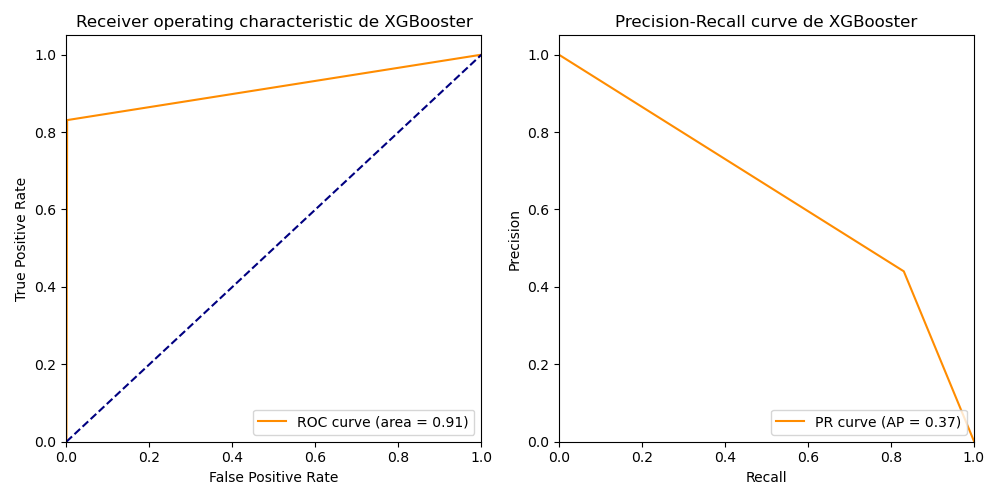

# Ingeniero Industrial especializado en Análisis de Datos y Optimización Matemática

- [Email: jfrometa99@gmail.com](mailto:jfrometa99@gmail.com)
- [LinkedIn](https://www.linkedin.com/in/jorge-israel-frometa-moya/)
- [Credly](https://www.credly.com/users/jorge-frometa)
- [Google Scholar](https://scholar.google.com/citations?user=FYjO18MAAAAJ&hl=es&oi=ao)

## Resumen
Ingeniero Industrial con más de 10 años de experiencia en optimización de procesos logísticos y productivos, análisis de datos y transformación digital. A lo largo de mi carrera, he utilizado herramientas avanzadas como Python, SQL y modelos matemáticos para optimizar cadenas de suministro y productividad operativa en diversas industrias. Actualmente, estoy profundizando en Cloud Computing, Inteligencia Artificial y Machine Learning, como parte del programa AWS re/Start, para potenciar la toma de decisiones y la automatización de procesos en entornos empresariales.

## Tabla de Contenidos
- [Habilidades Técnicas](#Habilidades-técnicas)
- [Educación](#Educación)
- [Experiencia Laboral](#Experiencia-laboral)
- [Certificaciones](#Certificaciones)
- [Proyectos en GitHub](#Proyectos-en-Github)
- [Publicaciones](#Publicaciones)

## Habilidades técnicas: 

- Lenguajes de programación: Python para análisis de datos y optimización (Pandas, NumPy, Scikit-learn) y SQL.
- Optimización matemática: Programación lineal, entera mixta y cuadrática mixta, programación dinámica, teoría de grafos (gurobipy, pyomo).
- Análisis de datos: Visualización, procesamiento y modelado (Matplotlib, Seaborn, Plotly, Power BI, Excel).
- Algoritmos de aprendizaje automático en python (Scikit-learn).
- Control estadístico de procesos industriales.
- Gestión logística de cadenas de suministros y ruteo vehicular.
- AWS Cloud Computing (EC2, S3, Lambda).
- Orquestación de sistemas potenciados con Inteligencia Artificial (Langgraph, Google ADK, Pydantic AI).

## Educación		        		
- Ingeniería Industrial | Universidad de Holguín, Cuba (_Diciembre 2012_)

## Experiencia laboral
**Profesor y Consultor empresarial @ Universidad de Oriente, Cuba (_Octubre 2015_ - _Abril 2024_)**
- Impartición de asignaturas especializadas en Estadística, Simulación e Investigación de Operaciones para estudiantes de Ingeniería Industrial.
- Colaboración Interdisciplinaria: Trabajo en equipo con especialistas de diversas disciplinas científicas como las ciencias económicas y las ciencias de la información.
- Participación en proyectos de investigación enfocados en la optimización de procesos de producción y logística como:
  * Optimización de la planificación de la producción de la industria pesquera mediante programación lineal, generando un aumento de 900,000 pesos en utilidades.
  * Optimización de la distribución logística de materias primas en la industria tabacalera mediante programación entera cuadrática mixta.

**Especialista de gestión de operaciones logística @ Corporación Cubapetróleo, Cuba (_Febrero 2013_ - _Abril 2024_)**
- Análisis de Datos: Aplicación de herramientas de estadística y simulación para evaluar y optimizar las cadenas de suministro y flujos logísticos.
- Optimización del sistema de distribución de gas licuado del petróleo en Santiago de Cuba mediante programación lineal entera mixta y metodos heurísticos, con un aumento de la eficiencia del 63%.
- Colaboración Interdisciplinaria: Trabajo en equipo con áreas clave como transporte, compras e informática para garantizar el cumplimiento de los objetivos organizacionales.

## Certificaciones

- Certificado Profesional de Análisis de Datos – Google (Bootcamp, España)
- Certificado Profesional de Ciencia de Datos – IBM (Bootcamp, España)
- Curso de Power BI de IBM-Datahack (Bootcamp, España)
- Programa de Aprendizaje Basado en Proyectos en Inteligencia Artificial de IBM (Bootcamp, España)
- AWS Certified Cloud Practitioner

## Proyectos en Github

### Warehouse Analytics Dashboard with AI Agents

Panel de análisis integral de gestión de almacén construido con **Plotly Dash**, mejorado con agentes de **IA** especializados impulsados por Google Gemini. Este proyecto proporciona insights (conocimientos) inteligentes sobre los niveles de servicio al cliente, la previsión de la demanda de materiales y la gestión de inventario.

### Optimización de Producción con programación lineal usando Python, Flask, Gurobi, matplotlib y AWS
- [Artículo en Dialnet](https://dialnet.unirioja.es/servlet/articulo?codigo=9472260).
- [Link del repositorio en Github](https://github.com/jfrometa88/aws-flask-gurobi-pl)

Este proyecto es parte de una ruta de aprendizaje con enfoque práctico de servicios de **Amazon Web Service (AWS)**, diseñado para principiantes en **Cloud Computing**. El mismo se concibió y probó en un Sandbox de **AWS** diseñado para el aprendizaje y por tanto con restricciones en su uso. Su objetivo es proporcionar una experiencia práctica en el uso de **AWS Management Console y AWS Command Line Interface (CLI)**, con servicios de Cloud Computing como **AWS EC2, S3 y otros servicios asociados como VPC, IAM**. Combinando estos con una implmentación de una aplicación web usando **Python** con **Python SDK para AWS, Gurobi, Matplotlib y Flask** para introducir datos, resolver y acceder a los resultados de un modelo de **optimización matemática de programación lineal** basado en un caso de estudio real (accediendo vía web por Internet).

### Ruteo vehicular y manejo de inventario con programación matemática
- [Link de Publicación científica](https://www.upo.es/revistas/index.php/RevMetCuant/article/view/3574/5108)
- [Link del repositorio en Github](https://github.com/jfrometa88/Ruteo-vehicular-con-programacion-matematica)

Contiene una implementación en **Python** del del modelo matemático propuesto en el artículo científico "Modelo heurístico híbrido para el ruteo vehicular y manejo de inventario en una entidad comercializadora de combustibles". Este proyecto tiene como objetivo optimizar la planificación de la de combustibles por etapas en una situación dada en una entidad comercializadora de combustibles de Santiago de Cuba, maximizando en cada etapa el valor del indicador tráfico de mercancías (un ratio que al ser maximizado permite maximizar la cantidad de mercancía distribuida mientras se minimiza la distancia recorrida) mientras se cumplen restricciones impuestas por el entorno en el que se realiza la distribución.

### Optimización de la Planificación de Producción con Programación Lineal
- [Link de Publicación científica](https://dialnet.unirioja.es/servlet/articulo?codigo=9472260)
- [Link del repositorio en Github](https://github.com/jfrometa88/Optimizaci-n-de-la-Planificaci-n-de-Producci-n-con-Programaci-n-Lineal)

Contiene una implementación en **Python** del modelo de programación lineal propuesto en el artículo científico "Planificación productiva del procesamiento pesquero en Santiago de Cuba mediante programación lineal". Este proyecto tiene como objetivo optimizar la planificación de la producción en un entorno industrial, maximizando las utilidades operativas mientras se cumplen restricciones productivas, económicas y sociales.

### Análisis de Vulnerabilidad Económica y su relación con indicadores de disponibilidad de bicicletas como servicio público y nivel de ruido en Valencia
[Link del repositorio en Github](https://github.com/jfrometa88/Analisis-de-datos-abiertos-valencia)

Analiza la vulnerabilidad económica en distintas zonas de Valencia y su posible relación con indicadores como el nivel medio de ruido y la disponibilidad de bicicletas de transporte público. Se emplean técnicas de estadística descriptiva, visualización de datos y pruebas de hipótesis como ANOVA para investigar patrones y diferencias entre grupos.

### Applied Data Science Capstone - SpaceX Launch Analysis
[Link del repositorio en Github](https://github.com/jfrometa88/Applied-Data-Science-Capstone)

Es parte del bootcamp de ciencia de datos de IBM y tiene como objetivo analizar los datos de lanzamientos de SpaceX para responder preguntas clave como:
- ¿Qué factores afectan el éxito de los lanzamientos de SpaceX?
- ¿Es posible predecir la probabilidad de un aterrizaje exitoso de la primera etapa utilizando modelos predictivos?
El análisis abarca desde la recolección de datos hasta la creación de modelos predictivos, incluyendo herramientas interactivas y visualizaciones dinámicas.

### Proyecto Final Programa de inteligencia artificial IBM - Análisis de Fraude en Tarjetas de Crédito
[Link del repositorio en Github](https://github.com/jfrometa88/Proyecto-Final-IBM-AI)

Este proyecto es parte del Programa de Aprendizaje Basado en Proyectos en Inteligencia Artificial de IBM. Utiliza el dataset de Kaggle: Credit Card Fraud Detection para identificar transacciones fraudulentas mediante técnicas de Machine Learning.

## Publicaciones 
1. Frómeta-Moya, J. I., & Labrada-Díaz, T. (2023). Planificación productiva del procesamiento pesquero en Santiago de Cuba mediante programación lineal. Ingeniería Industrial, 44(1), 96-109.
2. Frómeta-Moya, J. I., Ferrales-Arias, Y., & Pérez-Falcón, J. A. (2018). Procedimiento para el diagnóstico del sistema de producción en una empresa de materiales de construcción. Procedure for the diagnosis of the system production at a building materials company. Anuario Facultad de Ciencias Económicas y Empresariales, 29-44.
3. Frómeta Moya, J. I., & Pérez Campos, J. D. J. (2021). Modelo heurístico híbrido para el ruteo vehicular y manejo de inventario en una entidad comercializadora de combustibles. Revista de Métodos Cuantitativos para la Economía y la Empresa, 31, 363-383.
4. Moya, J. I. F., Velázquez, D. R. T., Mastrapa, L. H., & León, Y. O. L. (2020). Integrated mathematical model based on a heuristic method for loading and routing of vehicles: application in a tobacco company. Independent Journal of Management & Production, 11(6), 2091-2111.
5. Frómeta-Moya, J. I., & Marrero-Delgado, F. (2022). Ruteo vehicular con inventario y sistemas de apoyo para decisiones: una revisión con análisis bibliométrico. Santiago, (Especial), 234.

